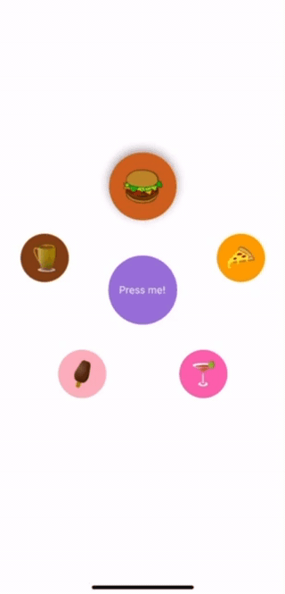

react-native-circular-layout
=========================


A versatile React Native component that arranges its children in a circular or elliptical layout. <br>
It supports touch gesture rotation, animations, and includes a variety of extra features.





## Table of Contents
- [Installation](#installation)
- [Dependencies](#dependencies)
- [Examples](#examples)
- [API Reference](#api-reference)
- [License](#license)

## Installation
-------

With npm:

```
npm install @iordanissap/react-native-circular-layout
```

With yarn:

```
yarn add @iordanissap/react-native-circular-layout
```


## Dependencies
-----------------

``` json
{
    "react": "18.2.0",
    "react-native": "0.74.2",
    "react-native-gesture-handler": "~2.16.1",
    "react-native-reanimated": "~3.10.1"
}
```

## Examples

## Props

| Prop Name              | Type                                            | Default           | Description                                                                                         |
|------------------------|-------------------------------------------------|-------------------|-----------------------------------------------------------------------------------------------------|
| `children(required)`             | `React.ReactNode`                               | -               | The children to be displayed in the circular layout                                                 |
| `radiusX(required)`              | `number` \| `SharedValue<number>`               | -               | The radius of the ellipse in the x direction. Can be a number or a shared value                     |
| `radiusY(required)`              | `number` \| `SharedValue<number>`               | -               | The radius of the ellipse in the y direction. Can be a number or a shared value                     |
| `centralComponent`     | `React.ReactNode`                               | `null`               | The central component to be displayed in the center of the circle/ellipse                           |
| `index`                | `number`                                        | `0`               | The index of the child that is currently snapped to the top.                                        |
| `snappingEnabled`      | `boolean`                                       | `true`           | Whether the view should snap to the nearest child                                                   |
| `onSnap`               | `(index: number) => void`                       | -               | The callback that is called when the view snaps to a child. Called when the animation ends.         |
| `onSnapStart`          | `(index: number) => void`                       | -               | The callback that is called when the snapping animation starts                                      |
| `snapAngle`            | `SnapAngle` \| `number`                         | `SnapAngle.Top`   | The angle at which the view should snap to the nearest child                                        |
| `gesturesEnabled`      | `boolean`                                       | `true`            | Whether the user can pan the view / rotate using touch                                              |
| `onGestureStart`       | `() => void`                                    | -               | The callback that is called when the user starts a gesture                                          |
| `onGestureEnd`         | `() => void`                                    | -               | The callback that is called when the user ends a gesture                                            |
| `rotateCentralComponent`| `boolean`                                      | `false`           | Whether the central component should rotate with the rest of the components                         |
| `childContainerStyle`  | `any`                                           | -               | The style of the container for the children                                                         |
| `animationConfig`      | `DecayConfig`                                   | -               | The configuration for the decay animation. Note: deceleration values below 0.9 will cause the animation to stop almost immediately. |

